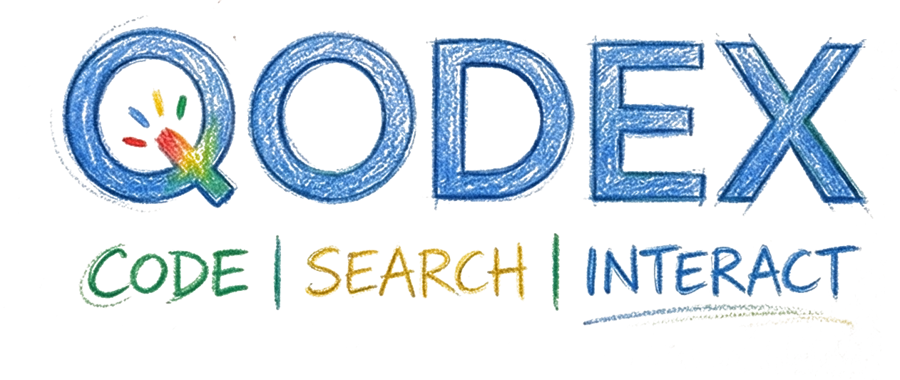
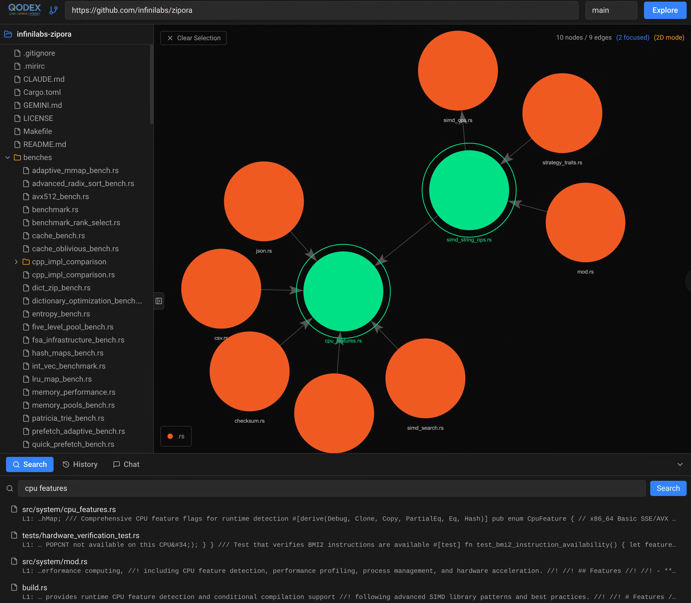

[](https://github.com/cloudymoma/qodex/actions/workflows/go.yml)

Interactive codebase visualizer. Paste a public GitHub URL, explore its dependency graph in 3D, search code, and browse files — all in a dark-themed web UI.



## Quick Start

```bash
make build-all   # build frontend + backend
make run          # start server at http://localhost:1983
```

Then open http://localhost:1983, paste a GitHub repo URL, and click **Explore**.

## Prerequisites

- Go 1.23+
- Node.js 20+ / npm
- Make

## Makefile Targets

| Target | Description |
|---|---|
| `make build-all` | Build frontend + Go backend (one step) |
| `make run` | Build and run the server |
| `make stop` | Stop the running server |
| `make test` | Run Go tests with race detection |
| `make frontend-dev` | Start Vite dev server (HMR on :5173) |
| `make clean` | Remove build artifacts |
| `make help` | Show all targets |

## Configuration

All settings in `conf.yaml` — port, storage paths, parser rules, CORS, logging. Defaults work out of the box.

